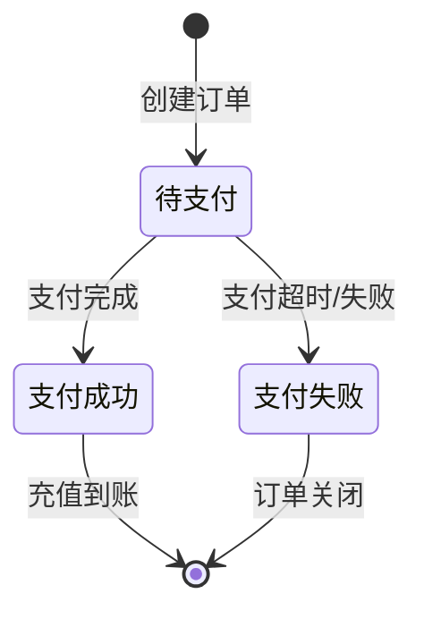
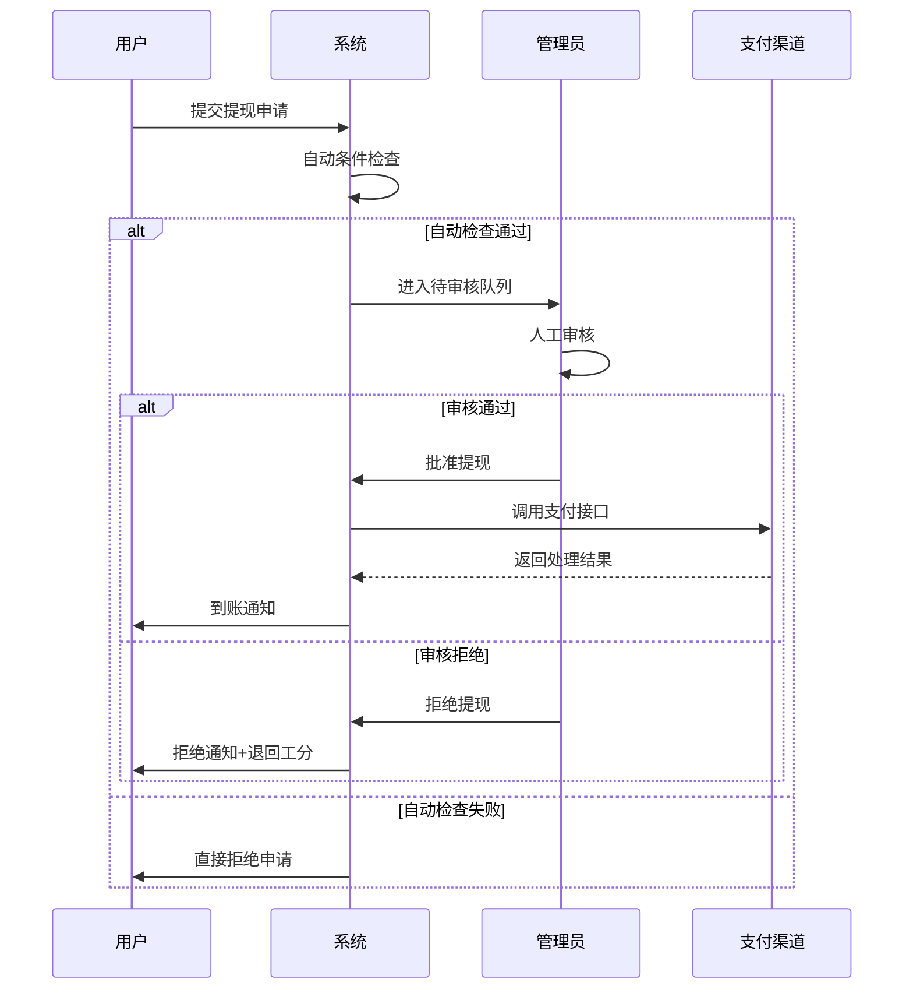

# 后台管理系统功能说明文档

## 一、系统架构概览

```
┌─────────────────────────────────────────────────────────────┐
│                    后台管理系统                              │
├─────────────────────────────────────────────────────────────┤
│                                                             │
│  ┌──────────┐  ┌──────────┐  ┌──────────┐  ┌──────────┐   │
│  │  仪表盘  │  │ 用户管理 │  │ 产品管理 │  │ 订单管理 │   │
│  └──────────┘  └──────────┘  └──────────┘  └──────────┘   │
│                                                             │
│  ┌──────────┐  ┌──────────┐  ┌──────────┐  ┌──────────┐   │
│  │ 算力管理 │  │ 提现管理 │  │ 任务管理 │  │ 财务管理 │   │
│  └──────────┘  └──────────┘  └──────────┘  └──────────┘   │
│                                                             │
│  ┌──────────┐  ┌──────────┐  ┌──────────┐  ┌──────────┐   │
│  │ 权限管理 │  │ 系统配置 │  │ 报表统计 │  │ 日志审计 │   │
│  └──────────┘  └──────────┘  └──────────┘  └──────────┘   │
│                                                             │
└─────────────────────────────────────────────────────────────┘
```

---

## 二、管理员与角色权限

### 2.1 角色层级

| 角色 | 权限级别 | 说明 |
|------|----------|------|
| **超级管理员** | Level 1 | 系统最高权限，可管理所有功能及管理员账号 |
| **运营管理员** | Level 2 | 负责日常运营：用户、订单、提现审核 |
| **财务管理员** | Level 3 | 负责财务相关：提现审核、充值确认、报表导出 |
| **客服管理员** | Level 4 | 负责用户服务：查看用户信息、处理投诉、查看日志 |
| **只读管理员** | Level 5 | 仅可查看数据，不可修改 |

### 2.2 权限矩阵

| 功能模块 | 超级管理员 | 运营管理员 | 财务管理员 | 客服管理员 | 只读管理员 |
|----------|:----------:|:----------:|:----------:|:----------:|:----------:|
| 仪表盘查看 | ✓ | ✓ | ✓ | ✓ | ✓ |
| 用户管理 | ✓ | ✓ | ○ | ✓ | ○ |
| 产品配置 | ✓ | ✓ | ✗ | ✗ | ○ |
| 订单管理 | ✓ | ✓ | ○ | ○ | ○ |
| 算力管理 | ✓ | ✓ | ○ | ○ | ○ |
| 提现审核 | ✓ | ○ | ✓ | ✗ | ○ |
| 任务配置 | ✓ | ✓ | ✗ | ✗ | ○ |
| 财务流水 | ✓ | ○ | ✓ | ✗ | ○ |
| 权限管理 | ✓ | ✗ | ✗ | ✗ | ✗ |
| 系统配置 | ✓ | ○ | ✗ | ✗ | ✗ |
| 报表导出 | ✓ | ○ | ✓ | ✗ | ✗ |

> ✓ = 完全权限 | ○ = 查看权限 | ✗ = 无权限

### 2.3 管理员账号管理

```
┌─────────────────────────────────────────┐
│           管理员账号管理                │
├─────────────────────────────────────────┤
│                                         │
│  ┌─────────────┐    ┌─────────────┐    │
│  │  添加管理员  │    │  角色分配   │    │
│  └─────────────┘    └─────────────┘    │
│                                         │
│  ┌─────────────┐    ┌─────────────┐    │
│  │  权限配置   │    │  操作日志   │    │
│  └─────────────┘    └─────────────┘    │
│                                         │
│  ┌─────────────┐    ┌─────────────┐    │
│  │  密码重置   │    │  账号禁用   │    │
│  └─────────────┘    └─────────────┘    │
│                                         │
└─────────────────────────────────────────┘
```

---

## 三、后台菜单结构

### 3.1 菜单树形图

```
后台管理系统
│
├── 📊 仪表盘 (Dashboard)
│   ├── 数据总览
│   ├── 实时统计
│   ├── 告警通知
│   └── 快捷入口
│
├── 👤 用户管理 (User Management)
│   ├── 用户列表
│   │   ├── 基本信息
│   │   ├── 资产信息
│   │   └── 操作记录
│   ├── 邀请层级
│   │   ├── 一级邀请
│   │   └── 二级邀请
│   └── KYC认证
│       ├── 待审核
│       ├── 已通过
│       └── 已拒绝
│
├── 🖥️ 产品管理 (Product Management)
│   ├── CPU产品配置
│   │   ├── 产品列表
│   │   ├── 新增产品
│   │   ├── 价格设置
│   │   └── 生产力%配置
│   ├── 产品上下架
│   └── 产品库存
│
├── 📦 订单管理 (Order Management)
│   ├── 充值订单
│   │   ├── 全部订单
│   │   ├── 待支付
│   │   ├── 支付成功
│   │   └── 支付失败
│   ├── 产品订单
│   │   ├── 待激活
│   │   ├── 生产中
│   │   └── 已过期
│   └── 订单退款
│
├── ⚡ 算力管理 (Hash Power Management)
│   ├── 算力产出统计
│   ├── 机器运行状态
│   ├── 签到记录
│   └── 算力转余额记录
│
├── 💰 提现管理 (Withdrawal Management)
│   ├── 提现审核
│   │   ├── 待审核
│   │   ├── 审核通过
│   │   ├── 审核拒绝
│   │   └── 处理中
│   ├── 提现记录
│   └── 提现配置
│       ├── 最低提现额
│       ├── 每日次数限制
│       └── 工分要求
│
├── 🎯 任务管理 (Task Management)
│   ├── 任务配置
│   │   ├── 每日签到
│   │   ├── 邀请好友
│   │   └── 每日首充
│   ├── 工分发放记录
│   └── 任务完成统计
│
├── 💳 财务管理 (Financial Management)
│   ├── 充值流水
│   ├── 提现流水
│   ├── 收益明细
│   ├── 工分流水
│   └── 资金对账
│
├── 📈 报表统计 (Reports & Statistics)
│   ├── 运营报表
│   │   ├── 日/周/月报
│   │   ├── 用户增长
│   │   └── 活跃用户
│   ├── 财务报表
│   │   ├── 充值统计
│   │   ├── 提现统计
│   │   └── 盈亏分析
│   └── 收益报表
│       ├── 算力产出
│       └── 平台收益
│
├── 🔐 权限管理 (Permission Management)
│   ├── 角色管理
│   ├── 管理员列表
│   ├── 权限配置
│   └── 操作日志
│
├── ⚙️ 系统配置 (System Configuration)
│   ├── 基础配置
│   │   ├── 平台名称
│   │   ├── 客服信息
│   │   └── 维护模式
│   ├── 支付配置
│   │   ├── 支付宝
│   │   ├── 微信支付
│   │   └── 快捷支付
│   └── 通知配置
│       ├── 短信配置
│       └── 邮件配置
│
└── 📋 日志审计 (Audit Logs)
    ├── 操作日志
    ├── 登录日志
    └── 异常日志
```

### 3.2 快捷操作面板

```
┌──────────────────────────────────────────────┐
│              快捷操作面板                     │
├──────────────────────────────────────────────┤
│                                              │
│  ┌────────┐ ┌────────┐ ┌────────┐ ┌────────┐│
│  │ 待审核 │ │ 待处理 │ │ 待退款 │ │ 告警  ││
│  │   12   │ │   5    │ │   3    │ │   1   ││
│  │  提现  │ │  KYC   │ │  订单  │ │       ││
│  └────────┘ └────────┘ └────────┘ └────────┘│
│                                              │
└──────────────────────────────────────────────┘
```

---

## 四、核心功能模块

### 4.1 仪表盘 (Dashboard)

#### 关键指标卡片

```
┌─────────────────────────────────────────────────────────────────┐
│                       今日关键指标                               │
├──────────────┬──────────────┬──────────────┬────────────────────┤
│   新增用户   │   充值金额   │   提现金额   │    算力产出        │
│     128      │   ¥52,800   │   ¥18,500   │   892,400 算力     │
│   ↑ 15%     │   ↑ 8%      │   ↓ 3%      │    ↑ 12%          │
└──────────────┴──────────────┴──────────────┴────────────────────┘
```

#### 数据图表
- 用户注册趋势图（近7天/30天）
- 充值提现对比图
- 算力产出趋势图
- 产品销量排行

#### 待办事项
- 待审核提现申请
- 待审核KYC认证
- 异常订单告警
- 系统通知

### 4.2 用户管理

#### 用户列表展示栏位（默认顺序）

| 顺序 | 栏位名称 | 字段Key | 宽度 | 排序 | 对齐 | 说明 |
|:----:|----------|---------|:----:|:----:|:----:|------|
| 1 | 用户ID | user_id | 80px | ✓ | 居中 | 唯一标识，点击可查看详情 |
| 2 | 用户名 | username | 120px | ✓ | 左对齐 | 用户昵称/姓名 |
| 3 | 手机号 | phone | 120px | ✗ | 居中 | 注册手机号（脱敏显示） |
| 4 | 邀请码 | invite_code | 100px | ✗ | 居中 | 个人邀请码 |
| 5 | 充值余额 | recharge_balance | 120px | ✓ | 右对齐 | ¥符号+千分位 |
| 6 | 可提现余额 | withdrawable_balance | 120px | ✓ | 右对齐 | ¥符号+千分位 |
| 7 | 工分数量 | work_points | 100px | ✓ | 右对齐 | 整数显示 |
| 8 | 机器数量 | machine_count | 100px | ✓ | 居中 | X 台 |
| 9 | 邀请人数 | invite_count | 100px | ✓ | 居中 | 一级+二级 |
| 10 | 注册时间 | created_at | 160px | ✓ | 居中 | YYYY-MM-DD HH:mm |
| 11 | 状态 | status | 80px | ✓ | 居中 | 正常/禁用（带标签色） |
| 12 | 操作 | actions | 150px | ✗ | 居中 | 查看/编辑/禁用/启用 |

**列表操作按钮：** 查看详情 | 编辑 | 禁用/启用 | 重置密码 | 调整余额

#### 数据导出功能

| 导出类型 | 导出字段 | 筛选条件 | 格式 |
|----------|----------|----------|------|
| 用户列表导出 | 全部用户字段 | 注册时间/状态/余额范围 | Excel |
| 用户资产导出 | 用户ID+资产信息 | 余额大于X的用户 | Excel |
| 邀请层级导出 | 邀请关系链 | 按邀请人筛选 | Excel |
| KYC记录导出 | KYC全部信息 | 审核状态/时间范围 | Excel |

**导出选项:**
- 支持按条件筛选导出（日期范围、用户状态、资产范围）
- 支持选择导出字段（全选/自定义）
- 支持导出格式：.xlsx / .csv
- 大数据量导出支持异步任务，完成后邮件通知

#### 用户详情页

```
┌─────────────────────────────────────────────┐
│              用户详情 - 张三                 │
├─────────────────────────────────────────────┤
│                                             │
│  ┌─────────────────────────────────────┐   │
│  │        基本信息                      │   │
│  ├─────────────────────────────────────┤   │
│  │  用户ID: 10086                      │   │
│  │  手机号: 138****8888               │   │
│  │  注册时间: 2024-01-15              │   │
│  │  邀请码: ABC123                     │   │
│  └─────────────────────────────────────┘   │
│                                             │
│  ┌─────────────────────────────────────┐   │
│  │        资产信息                      │   │
│  ├─────────────────────────────────────┤   │
│  │  充值余额: ¥10,000                 │   │
│  │  可提现余额: ¥3,500                │   │
│  │  工分数量: 850                     │   │
│  │  机器数量: 5 台                    │   │
│  └─────────────────────────────────────┘   │
│                                             │
│  ┌─────────────────────────────────────┐   │
│  │        邀请层级                      │   │
│  ├─────────────────────────────────────┤   │
│  │  一级邀请: 12 人                   │   │
│  │  二级邀请: 35 人                   │   │
│  │  团队收益: ¥1,200                  │   │
│  └─────────────────────────────────────┘   │
│                                             │
└─────────────────────────────────────────────┘
```

#### KYC认证列表展示栏位（默认顺序）

| 顺序 | 栏位名称 | 字段Key | 宽度 | 排序 | 对齐 | 说明 |
|:----:|----------|---------|:----:|:----:|:----:|------|
| 1 | 认证ID | kyc_id | 80px | ✓ | 居中 | 唯一认证标识 |
| 2 | 用户ID | user_id | 80px | ✓ | 居中 | 点击跳转用户详情 |
| 3 | 用户名 | username | 120px | ✓ | 左对齐 | 申请人昵称 |
| 4 | 真实姓名 | real_name | 100px | ✓ | 左对齐 | 身份证姓名 |
| 5 | 身份证号 | id_card_no | 160px | ✗ | 居中 | 脱敏显示（110***********1234） |
| 6 | 身份证正面 | id_card_front | 100px | ✗ | 居中 | 点击查看大图 |
| 7 | 身份证反面 | id_card_back | 100px | ✗ | 居中 | 点击查看大图 |
| 8 | 提交时间 | submitted_at | 160px | ✓ | 居中 | YYYY-MM-DD HH:mm |
| 9 | 审核状态 | status | 100px | ✓ | 居中 | 待审核/已通过/已拒绝 |
| 10 | 审核人 | auditor | 100px | ✓ | 居中 | 审核管理员姓名 |
| 11 | 审核时间 | audited_at | 160px | ✓ | 居中 | YYYY-MM-DD HH:mm |
| 12 | 拒绝原因 | reject_reason | 200px | ✗ | 左对齐 | 审核拒绝原因说明 |
| 13 | 操作 | actions | 150px | ✗ | 居中 | 审核通过/审核拒绝/查看详情 |

**状态标签颜色：** 待审核(橙色) | 已通过(绿色) | 已拒绝(红色)

**列表筛选条件：** 审核状态 | 提交日期 | 审核日期 | 用户ID | 审核人

#### 邀请层级列表展示栏位（默认顺序）

| 顺序 | 栏位名称 | 字段Key | 宽度 | 排序 | 对齐 | 说明 |
|:----:|----------|---------|:----:|:----:|:----:|------|
| 1 | 邀请ID | invite_id | 80px | ✓ | 居中 | 唯一邀请记录ID |
| 2 | 邀请人ID | inviter_id | 80px | ✓ | 居中 | 邀请人用户ID |
| 3 | 邀请人用户名 | inviter_name | 120px | ✓ | 左对齐 | 邀请人昵称 |
| 4 | 邀请人手机号 | inviter_phone | 120px | ✗ | 居中 | 邀请人手机号（脱敏） |
| 5 | 被邀请人ID | invitee_id | 80px | ✓ | 居中 | 被邀请人用户ID |
| 6 | 被邀请人用户名 | invitee_name | 120px | ✓ | 左对齐 | 被邀请人昵称 |
| 7 | 被邀请人手机号 | invitee_phone | 120px | ✗ | 居中 | 被邀请人手机号（脱敏） |
| 8 | 邀请层级 | level | 80px | ✓ | 居中 | 一级邀请/二级邀请 |
| 9 | 邀请时间 | created_at | 160px | ✓ | 居中 | YYYY-MM-DD HH:mm |
| 10 | 奖励金额 | reward_amount | 120px | ✓ | 右对齐 | 邀请奖励金额 |
| 11 | 被邀请人首充 | first_recharge | 120px | ✓ | 右对齐 | 被邀请人首次充值金额 |
| 12 | 邀请状态 | status | 100px | ✓ | 居中 | 有效/无效/待激活 |
| 13 | 操作 | actions | 100px | ✗ | 居中 | 查看详情 |

**状态标签颜色：** 有效(绿色) | 无效(灰色) | 待激活(橙色)

**列表筛选条件：** 邀请层级 | 邀请时间 | 邀请人ID | 被邀请人ID | 邀请状态

### 4.3 产品管理

#### CPU产品配置

| 配置项 | 说明 | 示例 |
|--------|------|------|
| 产品名称 | CPU产品名称 | 12代CPU-基础版 |
| 产品级别 | 算力计算基数 | 1000级 |
| 生产力% | 每小时产出比例 | 0.03% |
| 产品价格 | 购买价格 | ¥1,000 |
| 有效期 | 机器有效期 | 365天 |
| 库存数量 | 可售数量 | 100台 |
| 产品状态 | 上架/下架 | 上架 |

#### 产品列表展示栏位（默认顺序）

| 顺序 | 栏位名称 | 字段Key | 宽度 | 排序 | 对齐 | 说明 |
|:----:|----------|---------|:----:|:----:|:----:|------|
| 1 | 产品ID | product_id | 80px | ✓ | 居中 | 唯一产品标识 |
| 2 | 产品图片 | product_image | 80px | ✗ | 居中 | 缩略图展示 |
| 3 | 产品名称 | product_name | 180px | ✓ | 左对齐 | CPU产品名称 |
| 4 | 产品级别 | product_level | 100px | ✓ | 居中 | 算力计算基数（级） |
| 5 | 生产力% | productivity_rate | 100px | ✓ | 居中 | 每小时产出比例 |
| 6 | 每小时产出 | hourly_output | 120px | ✓ | 右对齐 | 自动计算（算力/小时） |
| 7 | 产品价格 | price | 120px | ✓ | 右对齐 | ¥符号+千分位 |
| 8 | 有效期 | validity_days | 100px | ✓ | 居中 | X 天 |
| 9 | 库存数量 | stock_quantity | 100px | ✓ | 右对齐 | 剩余可售数量 |
| 10 | 销量统计 | sales_count | 100px | ✓ | 右对齐 | 累计售出数量 |
| 11 | 创建时间 | created_at | 160px | ✓ | 居中 | YYYY-MM-DD HH:mm |
| 12 | 产品状态 | status | 100px | ✓ | 居中 | 上架/下架（带标签色） |
| 13 | 操作 | actions | 150px | ✗ | 居中 | 编辑/上下架/删除/查看销量 |

**状态标签颜色：** 上架(绿色) | 下架(灰色) | 库存不足(橙色)

**列表筛选条件：** 产品状态 | 价格范围 | 库存状态 | 创建时间 | 产品名称

#### 数据导出功能

| 导出类型 | 导出字段 | 筛选条件 | 格式 |
|----------|----------|----------|------|
| 产品配置导出 | 产品全部配置项 | 产品状态/类型 | Excel |
| 库存变动导出 | 库存操作记录 | 时间范围/操作类型 | Excel |
| 销售统计导出 | 产品销量/销售额 | 日期范围/产品 | Excel |

**导出选项:**
- 支持导出当前列表或全部数据
- 支持自定义字段顺序和显示名称
- 支持导出产品图片链接

#### 算力计算示例
```
产品级别: 1000级
生产力%: 0.03%
每小时产出 = 1000 × 0.03% = 30 算力/小时
每日产出 = 30 × 24 = 720 算力/日
```

### 4.4 订单管理

#### 充值订单状态



#### 订单列表展示栏位（默认顺序）

| 顺序 | 栏位名称 | 字段Key | 宽度 | 排序 | 对齐 | 说明 |
|:----:|----------|---------|:----:|:----:|:----:|------|
| 1 | 订单号 | order_no | 160px | ✓ | 居中 | 唯一订单号 |
| 2 | 用户ID | user_id | 80px | ✓ | 居中 | 点击跳转用户详情 |
| 3 | 用户名 | username | 120px | ✓ | 左对齐 | 下单用户昵称 |
| 4 | 订单类型 | order_type | 100px | ✓ | 居中 | 充值/购买产品 |
| 5 | 订单金额 | amount | 120px | ✓ | 右对齐 | ¥符号+千分位 |
| 6 | 支付通道 | pay_channel | 100px | ✓ | 居中 | 支付宝/微信/快捷支付/银行卡 |
| 7 | 订单状态 | status | 100px | ✓ | 居中 | 待支付/支付成功/支付失败（带标签色） |
| 8 | 创建时间 | created_at | 160px | ✓ | 居中 | YYYY-MM-DD HH:mm |
| 9 | 完成时间 | completed_at | 160px | ✓ | 居中 | YYYY-MM-DD HH:mm |
| 10 | 操作 | actions | 120px | ✗ | 居中 | 查看详情/退款/备注 |

**状态标签颜色：** 待支付(橙色) | 支付成功(绿色) | 支付失败(红色)

**列表筛选条件：** 日期范围 | 订单类型 | 订单状态 | 支付通道 | 金额范围 | 用户ID/用户名

#### 数据导出功能

| 导出类型 | 导出字段 | 筛选条件 | 格式 |
|----------|----------|----------|------|
| 订单列表导出 | 订单全部信息 | 日期/状态/金额/通道 | Excel |
| 充值统计导出 | 按日/周/月汇总 | 时间范围/支付通道 | Excel |
| 退款记录导出 | 退款详情 | 退款状态/时间 | Excel |

**导出选项:**
- 支持导出订单明细和汇总统计
- 支持导出支付通道对账文件
- 支持导出退款申请审批表

### 4.4.5 算力管理 (Hash Power Management)

#### 机器列表展示栏位（默认顺序）

| 顺序 | 栏位名称 | 字段Key | 宽度 | 排序 | 对齐 | 说明 |
|:----:|----------|---------|:----:|:----:|:----:|------|
| 1 | 机器ID | machine_id | 100px | ✓ | 居中 | 唯一机器标识 |
| 2 | 用户ID | user_id | 80px | ✓ | 居中 | 点击跳转用户详情 |
| 3 | 用户名 | username | 120px | ✓ | 左对齐 | 机器所有者昵称 |
| 4 | 产品名称 | product_name | 150px | ✓ | 左对齐 | 购买的产品名称 |
| 5 | 产品级别 | product_level | 100px | ✓ | 居中 | 算力级别 |
| 6 | 生产力% | productivity_rate | 100px | ✓ | 居中 | 产出比例 |
| 7 | 每小时产出 | hourly_output | 120px | ✓ | 右对齐 | 算力/小时 |
| 8 | 机器状态 | status | 100px | ✓ | 居中 | 待激活/生产中/已过期 |
| 9 | 激活时间 | activated_at | 160px | ✓ | 居中 | YYYY-MM-DD HH:mm |
| 10 | 到期时间 | expire_at | 160px | ✓ | 居中 | YYYY-MM-DD HH:mm |
| 11 | 累计产出 | total_output | 120px | ✓ | 右对齐 | 累计算力产出 |
| 12 | 最后结算 | last_settled_at | 160px | ✓ | 居中 | YYYY-MM-DD HH:mm |
| 13 | 操作 | actions | 120px | ✗ | 居中 | 查看详情/手动结算/延期 |

**状态标签颜色：** 待激活(橙色) | 生产中(绿色) | 已过期(灰色)

**列表筛选条件：** 机器状态 | 产品类型 | 激活时间 | 到期时间 | 用户ID

#### 算力产出记录列表展示栏位（默认顺序）

| 顺序 | 栏位名称 | 字段Key | 宽度 | 排序 | 对齐 | 说明 |
|:----:|----------|---------|:----:|:----:|:----:|------|
| 1 | 记录ID | record_id | 80px | ✓ | 居中 | 唯一记录标识 |
| 2 | 用户ID | user_id | 80px | ✓ | 居中 | 点击跳转用户详情 |
| 3 | 用户名 | username | 120px | ✓ | 左对齐 | 用户昵称 |
| 4 | 机器ID | machine_id | 100px | ✓ | 居中 | 产出机器ID |
| 5 | 产品名称 | product_name | 150px | ✓ | 左对齐 | 产品名称 |
| 6 | 产出算力 | hash_power | 120px | ✓ | 右对齐 | 本次产出算力值 |
| 7 | 产出类型 | output_type | 100px | ✓ | 居中 | 小时结算/日结算 |
| 8 | 结算周期 | settle_period | 120px | ✓ | 居中 | 结算时间段 |
| 9 | 产出时间 | created_at | 160px | ✓ | 居中 | YYYY-MM-DD HH:mm |
| 10 | 是否转入余额 | is_converted | 100px | ✓ | 居中 | 是/否 |
| 11 | 操作 | actions | 100px | ✗ | 居中 | 查看详情 |

**列表筛选条件：** 日期范围 | 产出类型 | 用户ID | 机器ID | 是否转入余额

#### 签到记录列表展示栏位（默认顺序）

| 顺序 | 栏位名称 | 字段Key | 宽度 | 排序 | 对齐 | 说明 |
|:----:|----------|---------|:----:|:----:|:----:|------|
| 1 | 记录ID | checkin_id | 80px | ✓ | 居中 | 唯一签到记录ID |
| 2 | 用户ID | user_id | 80px | ✓ | 居中 | 点击跳转用户详情 |
| 3 | 用户名 | username | 120px | ✓ | 左对齐 | 签到用户昵称 |
| 4 | 签到日期 | checkin_date | 100px | ✓ | 居中 | YYYY-MM-DD |
| 5 | 签到时间 | checkin_at | 160px | ✓ | 居中 | YYYY-MM-DD HH:mm:ss |
| 6 | 连续天数 | consecutive_days | 100px | ✓ | 居中 | 连续签到X天 |
| 7 | 奖励工分 | reward_points | 100px | ✓ | 右对齐 | 本次签到奖励 |
| 8 | 签到IP | ip_address | 120px | ✗ | 居中 | 签到来源IP |
| 9 | 签到设备 | device | 150px | ✗ | 左对齐 | 设备信息 |
| 10 | 操作 | actions | 100px | ✗ | 居中 | 查看详情 |

**列表筛选条件：** 日期范围 | 用户ID | 连续天数 | IP地址

### 4.5 提现管理

#### 提现审核流程



#### 提现申请列表展示栏位（默认顺序）

| 顺序 | 栏位名称 | 字段Key | 宽度 | 排序 | 对齐 | 说明 |
|:----:|----------|---------|:----:|:----:|:----:|------|
| 1 | 提现单号 | withdrawal_no | 160px | ✓ | 居中 | 唯一提现单号 |
| 2 | 用户ID | user_id | 80px | ✓ | 居中 | 点击跳转用户详情 |
| 3 | 用户名 | username | 120px | ✓ | 左对齐 | 申请用户昵称 |
| 4 | 提现金额 | amount | 120px | ✓ | 右对齐 | ¥符号+千分位 |
| 5 | 扣除工分 | deducted_points | 100px | ✓ | 右对齐 | 本次扣除工分数 |
| 6 | 银行卡号 | bank_card_no | 140px | ✗ | 居中 | 尾号4位显示（6222****8888） |
| 7 | 开户银行 | bank_name | 120px | ✓ | 左对齐 | 银行名称 |
| 8 | 持卡人 | card_holder | 100px | ✓ | 左对齐 | 持卡人姓名 |
| 9 | 申请时间 | created_at | 160px | ✓ | 居中 | YYYY-MM-DD HH:mm |
| 10 | 审核状态 | status | 100px | ✓ | 居中 | 待审核/审核通过/审核拒绝/处理中/到账成功/到账失败 |
| 11 | 审核人 | auditor | 100px | ✓ | 居中 | 审核管理员姓名 |
| 12 | 审核时间 | audited_at | 160px | ✓ | 居中 | YYYY-MM-DD HH:mm |
| 13 | 操作 | actions | 150px | ✗ | 居中 | 查看/审核通过/审核拒绝 |

**状态标签颜色：** 待审核(橙色) | 审核通过(蓝色) | 审核拒绝(红色) | 处理中(黄色) | 到账成功(绿色) | 到账失败(深红)

**列表筛选条件：** 日期范围 | 审核状态 | 金额范围 | 用户ID | 审核人 | 开户银行

#### 提现配置项

| 配置项 | 说明 | 默认值 |
|--------|------|--------|
| 最低工分要求 | 每次提现需扣除工分数 | 100工分 |
| 最低提现额 | 单次最低提现金额 | ¥100 |
| 每日提现次数 | 每用户每日最大提现次数 | 3次 |
| 每日提现上限 | 每用户每日最大提现金额 | ¥5,000 |
| 审核开关 | 是否需要人工审核 | 开启 |

#### 数据导出功能

| 导出类型 | 导出字段 | 筛选条件 | 格式 |
|----------|----------|----------|------|
| 提现申请导出 | 提现申请全部信息 | 日期/状态/金额 | Excel |
| 提现统计导出 | 按日/用户汇总 | 时间范围/审核状态 | Excel |
| 提现审核导出 | 审核记录+操作人 | 审核日期/操作员 | Excel |
| 打款记录导出 | 打款详情+银行信息 | 打款日期/状态 | Excel |

**导出选项:**
- 支持按审核状态筛选导出
- 支持导出银行打款批量文件（银行专用格式）
- 支持导出待审核清单供线下核对

### 4.6 任务管理

#### 任务配置表

| 任务类型 | 任务名称 | 工分奖励 | 完成条件 | 刷新周期 |
|----------|----------|----------|----------|----------|
| 签到 | 每日签到 | 10工分 | 点击签到 | 每日0点 |
| 邀请 | 邀请好友注册 | 50工分 | 好友完成注册 | 无限制 |
| 充值 | 每日首充 | 30工分 | 当日首次充值 | 每日0点 |

#### 任务记录列表展示栏位（默认顺序）

| 顺序 | 栏位名称 | 字段Key | 宽度 | 排序 | 对齐 | 说明 |
|:----:|----------|---------|:----:|:----:|:----:|------|
| 1 | 记录ID | id | 80px | ✓ | 居中 | 自增ID |
| 2 | 用户ID | user_id | 80px | ✓ | 居中 | 点击跳转用户详情 |
| 3 | 用户名 | username | 120px | ✓ | 左对齐 | 用户昵称 |
| 4 | 任务类型 | task_type | 100px | ✓ | 居中 | 每日签到/邀请好友/每日首充 |
| 5 | 任务名称 | task_name | 150px | ✓ | 左对齐 | 具体任务名称 |
| 6 | 奖励工分 | reward_points | 100px | ✓ | 右对齐 | +X 工分 |
| 7 | 完成时间 | completed_at | 160px | ✓ | 居中 | YYYY-MM-DD HH:mm |
| 8 | 任务日期 | task_date | 100px | ✓ | 居中 | YYYY-MM-DD |
| 9 | 完成状态 | status | 100px | ✓ | 居中 | 已完成/已发放/已撤销 |
| 10 | 操作 | actions | 100px | ✗ | 居中 | 查看/撤销发放 |

**列表筛选条件：** 日期范围 | 任务类型 | 用户ID | 完成状态 | 任务日期

#### 工分变动记录列表展示栏位（默认顺序）

| 顺序 | 栏位名称 | 字段Key | 宽度 | 排序 | 对齐 | 说明 |
|:----:|----------|---------|:----:|:----:|:----:|------|
| 1 | 记录ID | id | 80px | ✓ | 居中 | 自增ID |
| 2 | 用户ID | user_id | 80px | ✓ | 居中 | 点击跳转用户详情 |
| 3 | 用户名 | username | 120px | ✓ | 左对齐 | 用户昵称 |
| 4 | 变动类型 | change_type | 120px | ✓ | 居中 | 任务奖励/提现扣除/手动调整/活动赠送 |
| 5 | 变动数量 | points_change | 100px | ✓ | 右对齐 | +X / -X 带颜色（绿/红） |
| 6 | 变动前余额 | points_before | 100px | ✓ | 右对齐 | 变动前工分数 |
| 7 | 变动后余额 | points_after | 100px | ✓ | 右对齐 | 变动后工分数 |
| 8 | 关联单号 | related_no | 160px | ✓ | 居中 | 关联的提现单号/任务ID |
| 9 | 变动时间 | created_at | 160px | ✓ | 居中 | YYYY-MM-DD HH:mm |
| 10 | 操作人 | operator | 100px | ✓ | 居中 | 系统/管理员姓名 |
| 11 | 备注 | remark | 200px | ✗ | 左对齐 | 变动原因说明 |
| 12 | 操作 | actions | 100px | ✗ | 居中 | 查看详情 |

**列表筛选条件：** 日期范围 | 变动类型 | 用户ID | 操作人

#### 数据导出功能

| 导出类型 | 导出字段 | 筛选条件 | 格式 |
|----------|----------|----------|------|
| 任务记录导出 | 用户任务完成记录 | 日期/任务类型/用户 | Excel |
| 工分发放导出 | 工分变动明细 | 时间范围/变动类型 | Excel |
| 任务统计导出 | 任务完成率/参与人数 | 日期范围/任务类型 | Excel |

**导出选项:**
- 支持导出任务完成情况报表
- 支持导出工分流水对账单
- 支持导出用户任务达成率分析

### 4.7 财务管理

#### 资金流水类型

| 类型 | 收入 | 支出 | 说明 |
|------|:----:|:----:|------|
| 用户充值 | ✓ | - | 支付宝/微信/快捷支付 |
| 用户提现 | - | ✓ | 银行卡提现 |
| 算力转余额 | ✓ | - | 算力1:1转换 |
| 邀请奖励 | ✓ | - | 一级/二级邀请收益 |
| 工分抵扣 | - | - | 提现时扣除（不计入收支） |

#### 资金流水列表展示栏位（默认顺序）

| 顺序 | 栏位名称 | 字段Key | 宽度 | 排序 | 对齐 | 说明 |
|:----:|----------|---------|:----:|:----:|:----:|------|
| 1 | 流水号 | transaction_no | 160px | ✓ | 居中 | 唯一流水号 |
| 2 | 用户ID | user_id | 80px | ✓ | 居中 | 点击跳转用户详情 |
| 3 | 用户名 | username | 120px | ✓ | 左对齐 | 用户昵称 |
| 4 | 流水类型 | type | 120px | ✓ | 居中 | 用户充值/用户提现/算力转余额/邀请奖励 |
| 5 | 收支方向 | direction | 80px | ✓ | 居中 | 收入/支出/无（带标签色） |
| 6 | 变动金额 | amount | 120px | ✓ | 右对齐 | ¥符号+千分位（绿+/红-） |
| 7 | 余额变动前 | balance_before | 120px | ✓ | 右对齐 | 变动前余额 |
| 8 | 余额变动后 | balance_after | 120px | ✓ | 右对齐 | 变动后余额 |
| 9 | 支付通道 | pay_channel | 100px | ✓ | 居中 | 支付宝/微信/快捷支付/银行卡/系统 |
| 10 | 关联单号 | related_no | 160px | ✓ | 居中 | 订单号/提现单号 |
| 11 | 创建时间 | created_at | 160px | ✓ | 居中 | YYYY-MM-DD HH:mm |
| 12 | 流水状态 | status | 100px | ✓ | 居中 | 成功/失败/处理中 |
| 13 | 操作 | actions | 100px | ✗ | 居中 | 查看详情/标记异常 |

**列表筛选条件：** 日期范围 | 流水类型 | 收支方向 | 支付通道 | 金额范围 | 流水状态 | 用户ID

#### 对账功能
- 充值渠道对账（支付宝/微信/快捷支付）
- 提现支付对账
- 每日资金汇总
- 异常流水标记

#### 数据导出功能

| 导出类型 | 导出字段 | 筛选条件 | 格式 |
|----------|----------|----------|------|
| 资金流水导出 | 全部流水明细 | 日期/类型/用户 | Excel |
| 充值对账导出 | 渠道对账明细 | 日期范围/支付通道 | Excel |
| 提现对账导出 | 提现对账表 | 日期范围/处理状态 | Excel |
| 收益明细导出 | 收益来源明细 | 日期/收益类型/用户 | Excel |
| 资金日报导出 | 每日资金汇总 | 日期范围 | Excel |

**导出选项:**
- 支持导出财务审计专用格式（含会计科目）
- 支持导出银行对账单格式
- 支持导出资金流水明细和汇总表
- 支持导出指定用户的完整资金流水

---

### 4.8 权限管理

#### 管理员列表展示栏位（默认顺序）

| 顺序 | 栏位名称 | 字段Key | 宽度 | 排序 | 对齐 | 说明 |
|:----:|----------|---------|:----:|:----:|:----:|------|
| 1 | 管理员ID | admin_id | 80px | ✓ | 居中 | 唯一管理员标识 |
| 2 | 登录账号 | username | 120px | ✓ | 左对齐 | 后台登录账号 |
| 3 | 姓名 | real_name | 100px | ✓ | 左对齐 | 管理员真实姓名 |
| 4 | 角色 | role | 120px | ✓ | 居中 | 超级/运营/财务/客服/只读管理员 |
| 5 | 权限等级 | level | 80px | ✓ | 居中 | Level 1-5 |
| 6 | 手机号 | phone | 120px | ✗ | 居中 | 联系手机号（脱敏） |
| 7 | 邮箱 | email | 180px | ✓ | 左对齐 | 通知邮箱 |
| 8 | 最后登录 | last_login | 160px | ✓ | 居中 | YYYY-MM-DD HH:mm |
| 9 | 登录IP | login_ip | 120px | ✗ | 居中 | 上次登录IP |
| 10 | 状态 | status | 80px | ✓ | 居中 | 启用/禁用 |
| 11 | 创建时间 | created_at | 160px | ✓ | 居中 | YYYY-MM-DD HH:mm |
| 12 | 创建人 | creator | 100px | ✓ | 居中 | 创建者姓名 |
| 13 | 操作 | actions | 150px | ✗ | 居中 | 编辑/重置密码/禁用/权限配置 |

**状态标签颜色：** 启用(绿色) | 禁用(红色)

**列表筛选条件：** 角色 | 状态 | 创建时间 | 最后登录时间

#### 操作日志列表展示栏位（默认顺序）

| 顺序 | 栏位名称 | 字段Key | 宽度 | 排序 | 对齐 | 说明 |
|:----:|----------|---------|:----:|:----:|:----:|------|
| 1 | 日志ID | log_id | 80px | ✓ | 居中 | 唯一日志标识 |
| 2 | 操作时间 | created_at | 160px | ✓ | 居中 | YYYY-MM-DD HH:mm:ss |
| 3 | 操作人 | operator | 120px | ✓ | 左对齐 | 管理员姓名/账号 |
| 4 | 操作IP | ip_address | 120px | ✓ | 居中 | 操作来源IP |
| 5 | 操作模块 | module | 120px | ✓ | 居中 | 用户管理/订单管理/提现管理等 |
| 6 | 操作类型 | action_type | 100px | ✓ | 居中 | 新增/修改/删除/查询/导出/审核 |
| 7 | 操作对象 | target | 200px | ✗ | 左对齐 | 被操作的对象描述 |
| 8 | 对象ID | target_id | 120px | ✓ | 居中 | 被操作对象的ID |
| 9 | 操作结果 | result | 80px | ✓ | 居中 | 成功/失败 |
| 10 | 操作详情 | details | 300px | ✗ | 左对齐 | 操作前后数据对比 |
| 11 | 操作 | actions | 100px | ✗ | 居中 | 查看详情 |

**结果标签颜色：** 成功(绿色) | 失败(红色)

**列表筛选条件：** 日期时间范围 | 操作人 | 操作模块 | 操作类型 | 操作结果 | IP地址

---

## 五、报表统计

### 5.1 运营报表

#### 日报表字段

| 指标 | 说明 |
|------|------|
| 日期 | 统计日期 |
| 新增注册 | 新注册用户数量 |
| 活跃用户 | 登录用户数量 |
| 充值人数 | 成功充值用户数量 |
| 充值金额 | 当日充值总金额 |
| 提现人数 | 成功提现用户数量 |
| 提现金额 | 当日提现总金额 |
| 产品销量 | 当日售出机器数量 |
| 算力产出 | 当日总算力产出 |

### 5.2 财务报表

#### 资金汇总表

```
┌────────────────────────────────────────────────────────┐
│                   月度资金汇总 (2024-01)                │
├──────────────┬─────────────┬─────────────┬─────────────┤
│    项目      │  充值金额   │  提现金额   │   净额      │
├──────────────┼─────────────┼─────────────┼─────────────┤
│  支付宝      │  ¥358,000  │  ¥120,500  │  ¥237,500  │
│  微信支付    │  ¥256,000  │  ¥98,000   │  ¥158,000  │
│  快捷支付    │  ¥128,000  │  ¥45,500   │  ¥82,500   │
│  银行卡      │      -     │  ¥32,000   │  -¥32,000  │
├──────────────┼─────────────┼─────────────┼─────────────┤
│   合计       │  ¥742,000  │  ¥296,000  │  ¥446,000  │
└──────────────┴─────────────┴─────────────┴─────────────┘
```

### 5.3 收益报表

#### 平台收益分析

| 收益来源 | 计算公式 | 占比 |
|----------|----------|------|
| 机器成本 | 充值金额 × 28% | 28% |
| 算力产出 | 充值金额 × 72% | 72% |

### 5.4 报表导出功能

#### 导出类型汇总

| 报表类型 | 导出内容 | 时间维度 | 格式选项 |
|----------|----------|----------|----------|
| 运营日报 | 每日运营关键指标 | 单日/多日 | Excel/PDF/CSV |
| 运营周报 | 周度运营汇总 | 自然周/自定义 | Excel |
| 运营月报 | 月度运营分析 | 自然月/自定义 | Excel/PDF |
| 财务日报 | 每日资金流水汇总 | 单日/多日 | Excel |
| 财务月报 | 月度财务报表 | 自然月 | Excel/PDF |
| 用户增长报表 | 用户注册/活跃趋势 | 日/周/月 | Excel/Chart |
| 充值趋势报表 | 充值金额/人数趋势 | 日/周/月 | Excel/Chart |
| 提现趋势报表 | 提现金额/笔数趋势 | 日/周/月 | Excel/Chart |
| 产品销量报表 | 各产品销量排行 | 日/周/月/累计 | Excel |
| 算力产报表 | 算力产出统计 | 日/周/月 | Excel |
| 邀请裂变报表 | 邀请层级分析 | 累计/时间段 | Excel |

#### 导出功能特性

| 功能 | 说明 |
|------|------|
| **定时导出** | 支持设置定时任务，自动生成日报/周报并邮件发送 |
| **模板导出** | 支持自定义报表模板，保存常用导出配置 |
| **多格式支持** | Excel(.xlsx)、CSV、PDF、图表(PNG/JPG) |
| **大数据导出** | 超过1万条数据自动转为异步任务，完成后下载 |
| **数据脱敏** | 导出时可选择是否脱敏（手机号/银行卡号隐藏） |
| **图表导出** | 报表中的图表可单独导出为图片 |
| **合并导出** | 支持将多个报表合并为一个Excel多sheet文件 |
| **自动邮件** | 导出完成后自动发送邮件给指定管理员 |

#### 导出权限控制

| 角色 | 可导出报表 | 数据范围 |
|------|----------|----------|
| 超级管理员 | 全部报表 | 全部数据 |
| 运营管理员 | 运营报表 | 全部数据 |
| 财务管理员 | 财务报表、资金流水 | 全部数据 |
| 客服管理员 | 用户列表、订单查询 | 部分脱敏数据 |
| 只读管理员 | 全部报表 | 全部数据（仅查看权限） |

---

## 六、系统配置

### 6.1 基础配置

| 配置项 | 说明 | 示例 |
|--------|------|------|
| 平台名称 | 网站显示名称 | XX算力平台 |
| 平台Logo | 网站Logo | logo.png |
| 客服电话 | 客服联系方式 | 400-xxx-xxxx |
| 客服微信 | 客服微信号 | support123 |
| ICP备案号 | 网站备案号 | 京ICP备xxxx |
| 维护模式 | 是否开启维护 | 关闭 |

### 6.2 支付配置

| 支付通道 | 配置项 | 说明 |
|----------|--------|------|
| 支付宝 | APPID | 支付宝应用ID |
| | 公钥/私钥 | RSA密钥对 |
| 微信支付 | 商户号 | 微信商户ID |
| | API密钥 | 微信支付密钥 |
| 快捷支付 | 接口地址 | 第三方支付接口 |
| | 商户号 | 商户标识 |

### 6.3 安全配置

| 配置项 | 说明 | 建议值 |
|--------|------|--------|
| 登录失败次数 | 允许失败次数 | 5次 |
| 锁定时间 | 账户锁定时间 | 30分钟 |
| 密码强度 | 最小密码要求 | 8位+大小写+数字 |
| 会话超时 | 自动登出时间 | 30分钟 |

### 6.4 导出功能配置

| 配置项 | 说明 | 默认值 |
|--------|------|--------|
| 单次导出上限 | 单次最多导出记录数 | 100,000条 |
| 异步导出阈值 | 超过该值转为异步导出 | 10,000条 |
| 导出文件保留 | 导出文件服务器保留时间 | 7天 |
| 默认导出格式 | 默认导出文件格式 | Excel(.xlsx) |
| 允许CSV导出 | 是否允许CSV格式导出 | 是 |
| 允许PDF导出 | 是否允许PDF格式导出 | 是 |
| 数据脱敏默认 | 导出时默认是否脱敏 | 否 |
| 导出邮件通知 | 导出完成后是否邮件通知 | 是 |
| 定时导出开关 | 是否开启定时报表导出 | 是 |
| 定时导出时间 | 日报/周报/月报生成时间 | 08:00 |

**导出存储配置:**
- 导出文件存储路径：`/data/exports/`
- 导出文件命名规则：`{模块}_{日期}_{随机码}.{格式}`
- 导出文件访问：临时下载链接（24小时有效）

---

## 七、日志审计

### 7.1 操作日志

记录内容：
- 操作时间
- 操作管理员
- 操作IP
- 操作模块
- 操作类型（增/删/改/查）
- 操作对象
- 操作前后数据对比
- 操作结果（成功/失败）

### 7.2 登录日志

记录内容：
- 登录时间
- 用户名
- 登录IP
- 登录设备
- 登录结果（成功/失败）
- 失败原因（如失败）

### 7.3 异常日志

记录内容：
- 异常时间
- 异常类型
- 异常描述
- 堆栈信息
- 影响范围
- 处理状态

### 7.4 日志导出功能

| 日志类型 | 导出内容 | 筛选条件 | 格式 |
|----------|----------|----------|------|
| 操作日志导出 | 全部操作记录 | 时间/管理员/模块/结果 | Excel/CSV |
| 登录日志导出 | 登录记录 | 时间/用户/IP/结果 | Excel/CSV |
| 异常日志导出 | 异常详情 | 时间/类型/处理状态 | Excel/CSV |
| 审计报告导出 | 汇总审计报告 | 时间范围 | PDF |

**导出选项:**
- 支持按时间范围、管理员、操作模块等多条件筛选
- 支持导出原始日志或汇总统计
- 支持审计专用格式导出（符合审计规范）
- 日志导出需二次确认（敏感操作）
- 自动记录日志导出行为本身

---

## 八、接口清单

### 8.1 后台管理API概览

| 模块 | 接口数量 | 主要功能 |
|------|----------|----------|
| 认证模块 | 5 | 登录/登出/密码修改/权限获取 |
| 用户管理 | 12 | 用户CRUD/资产调整/KYC管理 |
| 产品管理 | 8 | 产品CRUD/配置/上下架 |
| 订单管理 | 10 | 订单查询/状态管理/退款 |
| 算力管理 | 6 | 算力统计/签到记录/转换记录 |
| 提现管理 | 8 | 提现审核/记录查询/配置 |
| 任务管理 | 6 | 任务配置/工分调整/记录 |
| 财务管理 | 10 | 流水查询/对账/报表 |
| 系统配置 | 8 | 基础配置/支付配置/通知配置 |
| 日志审计 | 4 | 日志查询/导出/分析 |
| 导出模块 | 15+ | 全模块数据导出/报表生成/异步任务 |

### 8.2 导出功能专用API

| 接口名称 | 请求方式 | 功能说明 |
|----------|----------|----------|
| 用户列表导出 | POST /api/export/users | 导出用户数据到Excel |
| 订单列表导出 | POST /api/export/orders | 导出订单数据到Excel |
| 提现记录导出 | POST /api/export/withdrawals | 导出提现记录到Excel |
| 资金流水导出 | POST /api/export/transactions | 导出资金流水到Excel |
| 报表生成导出 | POST /api/export/report | 生成指定报表并导出 |
| 导出任务查询 | GET /api/export/tasks | 查询异步导出任务状态 |
| 导出文件下载 | GET /api/export/download | 下载导出的文件 |
| 导出模板列表 | GET /api/export/templates | 获取导出模板列表 |
| 定时导出配置 | PUT /api/export/schedule | 配置定时导出任务 |
| 导出权限检查 | GET /api/export/permission | 检查当前用户导出权限 |

**导出API通用参数:**

| 参数 | 类型 | 必填 | 说明 |
|------|------|:----:|------|
| export_format | string | 是 | 导出格式: xlsx/csv/pdf |
| filters | object | 否 | 筛选条件（日期范围、状态等） |
| fields | array | 否 | 指定导出字段，不传则全部 |
| sort_by | string | 否 | 排序字段 |
| sort_order | string | 否 | 排序方向: asc/desc |
| is_async | boolean | 否 | 是否异步导出（大数据量建议） |
| data_masking | boolean | 否 | 是否脱敏敏感数据 |
| callback_url | string | 否 | 异步导出完成回调地址 |

---

## 九、部署与维护

### 9.1 环境要求

| 组件 | 版本要求 |
|------|----------|
| 服务器 | Linux CentOS 7+ / Ubuntu 18+ |
| CPU | 4核+ |
| 内存 | 8GB+ |
| 存储 | 100GB+ SSD |
| 数据库 | MySQL 8.0+ / PostgreSQL 12+ |
| 缓存 | Redis 6.0+ |
| Web服务器 | Nginx 1.18+ |

### 9.2 备份策略

| 数据类型 | 备份频率 | 保留时间 |
|----------|----------|----------|
| 数据库 | 每日全量 | 30天 |
| 配置文件 | 每次修改 | 永久 |
| 日志文件 | 每日归档 | 90天 |
| 上传文件 | 实时同步 | 永久 |

---

## 十、附录

### 10.1 名词解释

| 名词 | 解释 |
|------|------|
| 算力 | 平台的虚拟货币，由机器生产产生 |
| 工分 | 提现必需的材料，通过完成任务获得 |
| 充值余额 | 用户充值的总金额 |
| 可提现余额 | 算力转换后可提现的金额 |
| 一级邀请 | 用户直接邀请的好友 |
| 二级邀请 | 用户的一级邀请的好友再邀请的用户 |
| 生产力% | 每小时算力产出的计算比例 |

### 10.2 计算公式汇总

```
每小时算力产出 = 产品级别 × 生产力%
每日算力产出 = 每小时产出 × 24小时
可提现余额 = 算力产出 × 1:1转换比例
提现条件 = 工分足够 AND 金额达标 AND 次数未超限
```

---

*文档版本: v1.0*
*最后更新: 2024-01*
