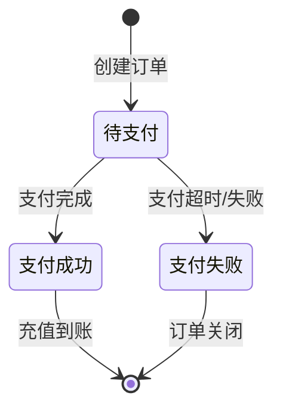
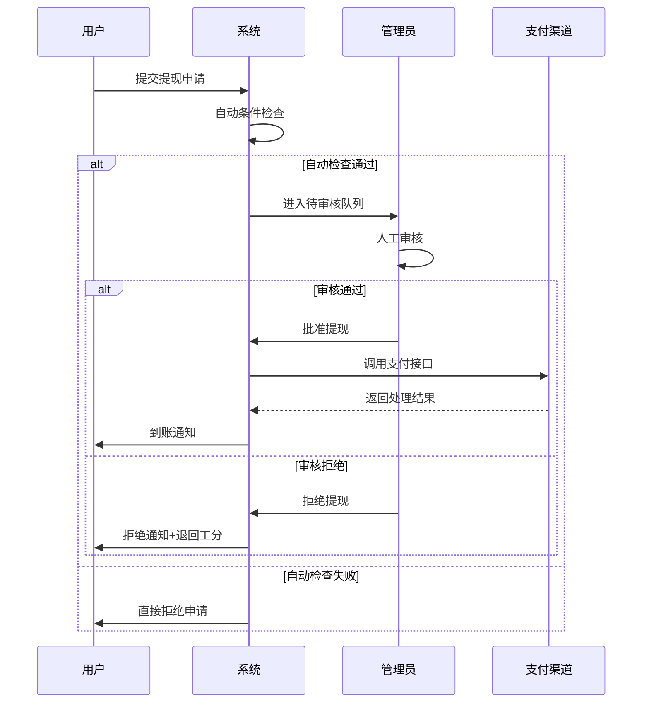

# 后台管理系统功能说明文档

## 一、系统架构概览

```
┌─────────────────────────────────────────────────────────────┐
│                    后台管理系统                              │
├─────────────────────────────────────────────────────────────┤
│                                                             │
│  ┌──────────┐  ┌──────────┐  ┌──────────┐  ┌──────────┐   │
│  │  仪表盘  │  │ 用户管理 │  │ 产品管理 │  │ 订单管理 │   │
│  └──────────┘  └──────────┘  └──────────┘  └──────────┘   │
│                                                             │
│  ┌──────────┐  ┌──────────┐  ┌──────────┐  ┌──────────┐   │
│  │ 算力管理 │  │ 提现管理 │  │ 任务管理 │  │ 财务管理 │   │
│  └──────────┘  └──────────┘  └──────────┘  └──────────┘   │
│                                                             │
│  ┌──────────┐  ┌──────────┐  ┌──────────┐  ┌──────────┐   │
│  │ 权限管理 │  │ 系统配置 │  │ 报表统计 │  │ 日志审计 │   │
│  └──────────┘  └──────────┘  └──────────┘  └──────────┘   │
│                                                             │
└─────────────────────────────────────────────────────────────┘
```

---

## 二、管理员与角色权限

### 2.1 角色层级

| 角色 | 权限级别 | 说明 |
|------|----------|------|
| **超级管理员** | Level 1 | 系统最高权限，可管理所有功能及管理员账号 |
| **运营管理员** | Level 2 | 负责日常运营：用户、订单、提现审核 |
| **财务管理员** | Level 3 | 负责财务相关：提现审核、充值确认、报表导出 |
| **客服管理员** | Level 4 | 负责用户服务：查看用户信息、处理投诉、查看日志 |
| **只读管理员** | Level 5 | 仅可查看数据，不可修改 |

### 2.2 权限矩阵

| 功能模块 | 超级管理员 | 运营管理员 | 财务管理员 | 客服管理员 | 只读管理员 |
|----------|:----------:|:----------:|:----------:|:----------:|:----------:|
| 仪表盘查看 | ✓ | ✓ | ✓ | ✓ | ✓ |
| 用户管理 | ✓ | ✓ | ○ | ✓ | ○ |
| 产品配置 | ✓ | ✓ | ✗ | ✗ | ○ |
| 订单管理 | ✓ | ✓ | ○ | ○ | ○ |
| 算力管理 | ✓ | ✓ | ○ | ○ | ○ |
| 提现审核 | ✓ | ○ | ✓ | ✗ | ○ |
| 任务配置 | ✓ | ✓ | ✗ | ✗ | ○ |
| 财务流水 | ✓ | ○ | ✓ | ✗ | ○ |
| 权限管理 | ✓ | ✗ | ✗ | ✗ | ✗ |
| 系统配置 | ✓ | ○ | ✗ | ✗ | ✗ |
| 报表导出 | ✓ | ○ | ✓ | ✗ | ✗ |

> ✓ = 完全权限 | ○ = 查看权限 | ✗ = 无权限

### 2.3 管理员账号管理

```
┌─────────────────────────────────────────┐
│           管理员账号管理                │
├─────────────────────────────────────────┤
│                                         │
│  ┌─────────────┐    ┌─────────────┐    │
│  │  添加管理员  │    │  角色分配   │    │
│  └─────────────┘    └─────────────┘    │
│                                         │
│  ┌─────────────┐    ┌─────────────┐    │
│  │  权限配置   │    │  操作日志   │    │
│  └─────────────┘    └─────────────┘    │
│                                         │
│  ┌─────────────┐    ┌─────────────┐    │
│  │  密码重置   │    │  账号禁用   │    │
│  └─────────────┘    └─────────────┘    │
│                                         │
└─────────────────────────────────────────┘
```

---

## 三、后台菜单结构

### 3.1 菜单树形图

```
后台管理系统
│
├── 📊 仪表盘 (Dashboard)
│   ├── 数据总览
│   ├── 实时统计
│   ├── 告警通知
│   └── 快捷入口
│
├── 👤 用户管理 (User Management)
│   ├── 用户列表
│   │   ├── 基本信息
│   │   ├── 资产信息
│   │   └── 操作记录
│   ├── 邀请层级
│   │   ├── 一级邀请
│   │   └── 二级邀请
│   └── KYC认证
│       ├── 待审核
│       ├── 已通过
│       └── 已拒绝
│
├── 🖥️ 产品管理 (Product Management)
│   ├── CPU产品配置
│   │   ├── 产品列表
│   │   ├── 新增产品
│   │   ├── 价格设置
│   │   └── 生产力%配置
│   ├── 产品上下架
│   └── 产品库存
│
├── 📦 订单管理 (Order Management)
│   ├── 充值订单
│   │   ├── 全部订单
│   │   ├── 待支付
│   │   ├── 支付成功
│   │   └── 支付失败
│   ├── 产品订单
│   │   ├── 待激活
│   │   ├── 生产中
│   │   └── 已过期
│   └── 订单退款
│
├── ⚡ 算力管理 (Hash Power Management)
│   ├── 算力产出统计
│   ├── 机器运行状态
│   ├── 签到记录
│   └── 算力转余额记录
│
├── 💰 提现管理 (Withdrawal Management)
│   ├── 提现审核
│   │   ├── 待审核
│   │   ├── 审核通过
│   │   ├── 审核拒绝
│   │   └── 处理中
│   ├── 提现记录
│   └── 提现配置
│       ├── 最低提现额
│       ├── 每日次数限制
│       └── 工分要求
│
├── 🎯 任务管理 (Task Management)
│   ├── 任务配置
│   │   ├── 每日签到
│   │   ├── 邀请好友
│   │   └── 每日首充
│   ├── 工分发放记录
│   └── 任务完成统计
│
├── 💳 财务管理 (Financial Management)
│   ├── 充值流水
│   ├── 提现流水
│   ├── 收益明细
│   ├── 工分流水
│   └── 资金对账
│
├── 📈 报表统计 (Reports & Statistics)
│   ├── 运营报表
│   │   ├── 日/周/月报
│   │   ├── 用户增长
│   │   └── 活跃用户
│   ├── 财务报表
│   │   ├── 充值统计
│   │   ├── 提现统计
│   │   └── 盈亏分析
│   └── 收益报表
│       ├── 算力产出
│       └── 平台收益
│
├── 🔐 权限管理 (Permission Management)
│   ├── 角色管理
│   ├── 管理员列表
│   ├── 权限配置
│   └── 操作日志
│
├── ⚙️ 系统配置 (System Configuration)
│   ├── 基础配置
│   │   ├── 平台名称
│   │   ├── 客服信息
│   │   └── 维护模式
│   ├── 支付配置
│   │   ├── 支付宝
│   │   ├── 微信支付
│   │   └── 快捷支付
│   └── 通知配置
│       ├── 短信配置
│       └── 邮件配置
│
└── 📋 日志审计 (Audit Logs)
    ├── 操作日志
    ├── 登录日志
    └── 异常日志
```

### 3.2 快捷操作面板

```
┌──────────────────────────────────────────────┐
│              快捷操作面板                     │
├──────────────────────────────────────────────┤
│                                              │
│  ┌────────┐ ┌────────┐ ┌────────┐ ┌────────┐│
│  │ 待审核 │ │ 待处理 │ │ 待退款 │ │ 告警  ││
│  │   12   │ │   5    │ │   3    │ │   1   ││
│  │  提现  │ │  KYC   │ │  订单  │ │       ││
│  └────────┘ └────────┘ └────────┘ └────────┘│
│                                              │
└──────────────────────────────────────────────┘
```

---

## 四、核心功能模块

### 4.1 仪表盘 (Dashboard)

#### 关键指标卡片

```
┌─────────────────────────────────────────────────────────────────┐
│                       今日关键指标                               │
├──────────────┬──────────────┬──────────────┬────────────────────┤
│   新增用户   │   充值金额   │   提现金额   │    算力产出        │
│     128      │   ¥52,800   │   ¥18,500   │   892,400 算力     │
│   ↑ 15%     │   ↑ 8%      │   ↓ 3%      │    ↑ 12%          │
└──────────────┴──────────────┴──────────────┴────────────────────┘
```

#### 数据图表
- 用户注册趋势图（近7天/30天）
- 充值提现对比图
- 算力产出趋势图
- 产品销量排行

#### 待办事项
- 待审核提现申请
- 待审核KYC认证
- 异常订单告警
- 系统通知

### 4.2 用户管理

#### 用户列表字段

| 字段 | 说明 | 操作 |
|------|------|------|
| 用户ID | 唯一标识 | - |
| 用户名 | 用户昵称 | - |
| 手机号 | 注册手机号 | - |
| 邀请码 | 个人邀请码 | 复制 |
| 充值余额 | 充值总额 | 查看明细 |
| 可提现余额 | 可提现金额 | 查看明细 |
| 工分数量 | 当前工分 | 调整 |
| 机器数量 | 购买机器数 | 查看列表 |
| 邀请人数 | 一级+二级 | 查看层级 |
| 注册时间 | 注册日期 | - |
| 状态 | 正常/禁用 | 启用/禁用 |

#### 用户详情页

```
┌─────────────────────────────────────────────┐
│              用户详情 - 张三                 │
├─────────────────────────────────────────────┤
│                                             │
│  ┌─────────────────────────────────────┐   │
│  │        基本信息                      │   │
│  ├─────────────────────────────────────┤   │
│  │  用户ID: 10086                      │   │
│  │  手机号: 138****8888               │   │
│  │  注册时间: 2024-01-15              │   │
│  │  邀请码: ABC123                     │   │
│  └─────────────────────────────────────┘   │
│                                             │
│  ┌─────────────────────────────────────┐   │
│  │        资产信息                      │   │
│  ├─────────────────────────────────────┤   │
│  │  充值余额: ¥10,000                 │   │
│  │  可提现余额: ¥3,500                │   │
│  │  工分数量: 850                     │   │
│  │  机器数量: 5 台                    │   │
│  └─────────────────────────────────────┘   │
│                                             │
│  ┌─────────────────────────────────────┐   │
│  │        邀请层级                      │   │
│  ├─────────────────────────────────────┤   │
│  │  一级邀请: 12 人                   │   │
│  │  二级邀请: 35 人                   │   │
│  │  团队收益: ¥1,200                  │   │
│  └─────────────────────────────────────┘   │
│                                             │
└─────────────────────────────────────────────┘
```

### 4.3 产品管理

#### CPU产品配置

| 配置项 | 说明 | 示例 |
|--------|------|------|
| 产品名称 | CPU产品名称 | 12代CPU-基础版 |
| 产品级别 | 算力计算基数 | 1000级 |
| 生产力% | 每小时产出比例 | 0.03% |
| 产品价格 | 购买价格 | ¥1,000 |
| 有效期 | 机器有效期 | 365天 |
| 库存数量 | 可售数量 | 100台 |
| 产品状态 | 上架/下架 | 上架 |

#### 算力计算示例
```
产品级别: 1000级
生产力%: 0.03%
每小时产出 = 1000 × 0.03% = 30 算力/小时
每日产出 = 30 × 24 = 720 算力/日
```

### 4.4 订单管理

#### 充值订单状态



#### 订单列表字段

| 字段 | 说明 |
|------|------|
| 订单号 | 唯一订单号 |
| 用户ID | 下单用户 |
| 订单类型 | 充值/购买产品 |
| 订单金额 | 交易金额 |
| 支付通道 | 支付宝/微信/快捷支付 |
| 订单状态 | 待支付/成功/失败 |
| 创建时间 | 下单时间 |
| 完成时间 | 支付完成时间 |

### 4.5 提现管理

#### 提现审核流程



#### 提现配置项

| 配置项 | 说明 | 默认值 |
|--------|------|--------|
| 最低工分要求 | 每次提现需扣除工分数 | 100工分 |
| 最低提现额 | 单次最低提现金额 | ¥100 |
| 每日提现次数 | 每用户每日最大提现次数 | 3次 |
| 每日提现上限 | 每用户每日最大提现金额 | ¥5,000 |
| 审核开关 | 是否需要人工审核 | 开启 |

### 4.6 任务管理

#### 任务配置表

| 任务类型 | 任务名称 | 工分奖励 | 完成条件 | 刷新周期 |
|----------|----------|----------|----------|----------|
| 签到 | 每日签到 | 10工分 | 点击签到 | 每日0点 |
| 邀请 | 邀请好友注册 | 50工分 | 好友完成注册 | 无限制 |
| 充值 | 每日首充 | 30工分 | 当日首次充值 | 每日0点 |

#### 任务统计
- 每日任务完成人数
- 工分发放总量
- 任务完成率趋势

### 4.7 财务管理

#### 资金流水类型

| 类型 | 收入 | 支出 | 说明 |
|------|:----:|:----:|------|
| 用户充值 | ✓ | - | 支付宝/微信/快捷支付 |
| 用户提现 | - | ✓ | 银行卡提现 |
| 算力转余额 | ✓ | - | 算力1:1转换 |
| 邀请奖励 | ✓ | - | 一级/二级邀请收益 |
| 工分抵扣 | - | - | 提现时扣除（不计入收支） |

#### 对账功能
- 充值渠道对账（支付宝/微信/快捷支付）
- 提现支付对账
- 每日资金汇总
- 异常流水标记

---

## 五、报表统计

### 5.1 运营报表

#### 日报表字段

| 指标 | 说明 |
|------|------|
| 日期 | 统计日期 |
| 新增注册 | 新注册用户数量 |
| 活跃用户 | 登录用户数量 |
| 充值人数 | 成功充值用户数量 |
| 充值金额 | 当日充值总金额 |
| 提现人数 | 成功提现用户数量 |
| 提现金额 | 当日提现总金额 |
| 产品销量 | 当日售出机器数量 |
| 算力产出 | 当日总算力产出 |

### 5.2 财务报表

#### 资金汇总表

```
┌────────────────────────────────────────────────────────┐
│                   月度资金汇总 (2024-01)                │
├──────────────┬─────────────┬─────────────┬─────────────┤
│    项目      │  充值金额   │  提现金额   │   净额      │
├──────────────┼─────────────┼─────────────┼─────────────┤
│  支付宝      │  ¥358,000  │  ¥120,500  │  ¥237,500  │
│  微信支付    │  ¥256,000  │  ¥98,000   │  ¥158,000  │
│  快捷支付    │  ¥128,000  │  ¥45,500   │  ¥82,500   │
│  银行卡      │      -     │  ¥32,000   │  -¥32,000  │
├──────────────┼─────────────┼─────────────┼─────────────┤
│   合计       │  ¥742,000  │  ¥296,000  │  ¥446,000  │
└──────────────┴─────────────┴─────────────┴─────────────┘
```

### 5.3 收益报表

#### 平台收益分析

| 收益来源 | 计算公式 | 占比 |
|----------|----------|------|
| 机器成本 | 充值金额 × 28% | 28% |
| 算力产出 | 充值金额 × 72% | 72% |

---

## 六、系统配置

### 6.1 基础配置

| 配置项 | 说明 | 示例 |
|--------|------|------|
| 平台名称 | 网站显示名称 | XX算力平台 |
| 平台Logo | 网站Logo | logo.png |
| 客服电话 | 客服联系方式 | 400-xxx-xxxx |
| 客服微信 | 客服微信号 | support123 |
| ICP备案号 | 网站备案号 | 京ICP备xxxx |
| 维护模式 | 是否开启维护 | 关闭 |

### 6.2 支付配置

| 支付通道 | 配置项 | 说明 |
|----------|--------|------|
| 支付宝 | APPID | 支付宝应用ID |
| | 公钥/私钥 | RSA密钥对 |
| 微信支付 | 商户号 | 微信商户ID |
| | API密钥 | 微信支付密钥 |
| 快捷支付 | 接口地址 | 第三方支付接口 |
| | 商户号 | 商户标识 |

### 6.3 安全配置

| 配置项 | 说明 | 建议值 |
|--------|------|--------|
| 登录失败次数 | 允许失败次数 | 5次 |
| 锁定时间 | 账户锁定时间 | 30分钟 |
| 密码强度 | 最小密码要求 | 8位+大小写+数字 |
| 会话超时 | 自动登出时间 | 30分钟 |

---

## 七、日志审计

### 7.1 操作日志

记录内容：
- 操作时间
- 操作管理员
- 操作IP
- 操作模块
- 操作类型（增/删/改/查）
- 操作对象
- 操作前后数据对比
- 操作结果（成功/失败）

### 7.2 登录日志

记录内容：
- 登录时间
- 用户名
- 登录IP
- 登录设备
- 登录结果（成功/失败）
- 失败原因（如失败）

### 7.3 异常日志

记录内容：
- 异常时间
- 异常类型
- 异常描述
- 堆栈信息
- 影响范围
- 处理状态

---

## 八、接口清单

### 8.1 后台管理API概览

| 模块 | 接口数量 | 主要功能 |
|------|----------|----------|
| 认证模块 | 5 | 登录/登出/密码修改/权限获取 |
| 用户管理 | 12 | 用户CRUD/资产调整/KYC管理 |
| 产品管理 | 8 | 产品CRUD/配置/上下架 |
| 订单管理 | 10 | 订单查询/状态管理/退款 |
| 算力管理 | 6 | 算力统计/签到记录/转换记录 |
| 提现管理 | 8 | 提现审核/记录查询/配置 |
| 任务管理 | 6 | 任务配置/工分调整/记录 |
| 财务管理 | 10 | 流水查询/对账/报表 |
| 系统配置 | 8 | 基础配置/支付配置/通知配置 |
| 日志审计 | 4 | 日志查询/导出/分析 |

---

## 九、部署与维护

### 9.1 环境要求

| 组件 | 版本要求 |
|------|----------|
| 服务器 | Linux CentOS 7+ / Ubuntu 18+ |
| CPU | 4核+ |
| 内存 | 8GB+ |
| 存储 | 100GB+ SSD |
| 数据库 | MySQL 8.0+ / PostgreSQL 12+ |
| 缓存 | Redis 6.0+ |
| Web服务器 | Nginx 1.18+ |

### 9.2 备份策略

| 数据类型 | 备份频率 | 保留时间 |
|----------|----------|----------|
| 数据库 | 每日全量 | 30天 |
| 配置文件 | 每次修改 | 永久 |
| 日志文件 | 每日归档 | 90天 |
| 上传文件 | 实时同步 | 永久 |

---

## 十、附录

### 10.1 名词解释

| 名词 | 解释 |
|------|------|
| 算力 | 平台的虚拟货币，由机器生产产生 |
| 工分 | 提现必需的材料，通过完成任务获得 |
| 充值余额 | 用户充值的总金额 |
| 可提现余额 | 算力转换后可提现的金额 |
| 一级邀请 | 用户直接邀请的好友 |
| 二级邀请 | 用户的一级邀请的好友再邀请的用户 |
| 生产力% | 每小时算力产出的计算比例 |

### 10.2 计算公式汇总

```
每小时算力产出 = 产品级别 × 生产力%
每日算力产出 = 每小时产出 × 24小时
可提现余额 = 算力产出 × 1:1转换比例
提现条件 = 工分足够 AND 金额达标 AND 次数未超限
```

---

*文档版本: v1.0*
*最后更新: 2024-01*
