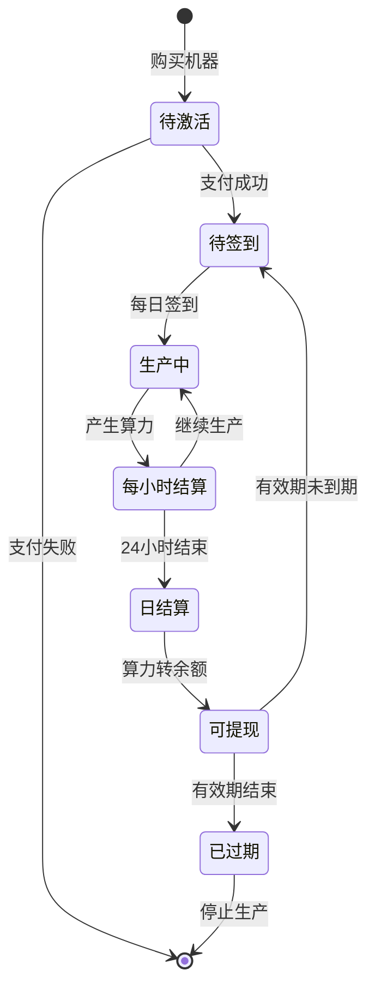
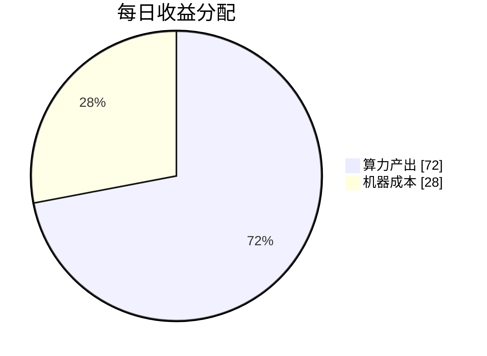
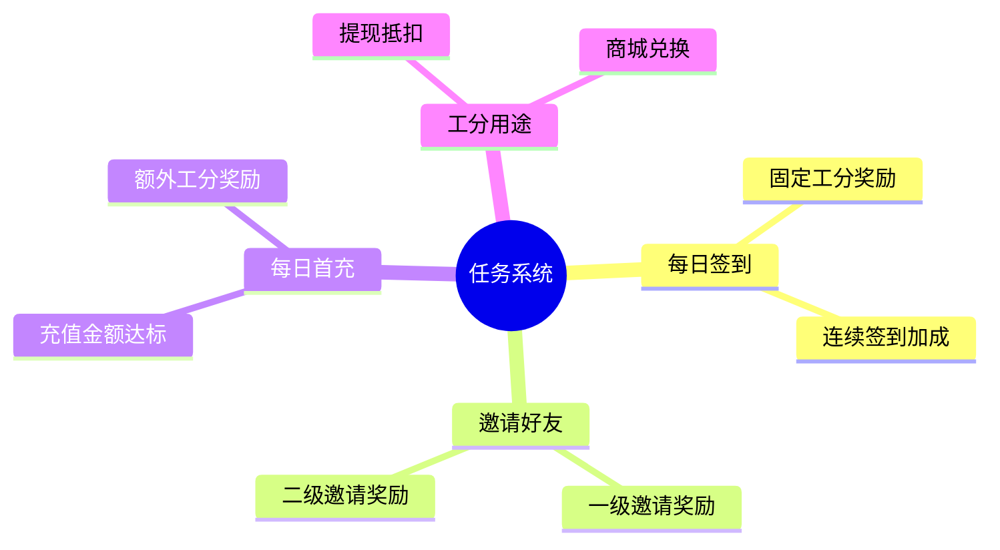
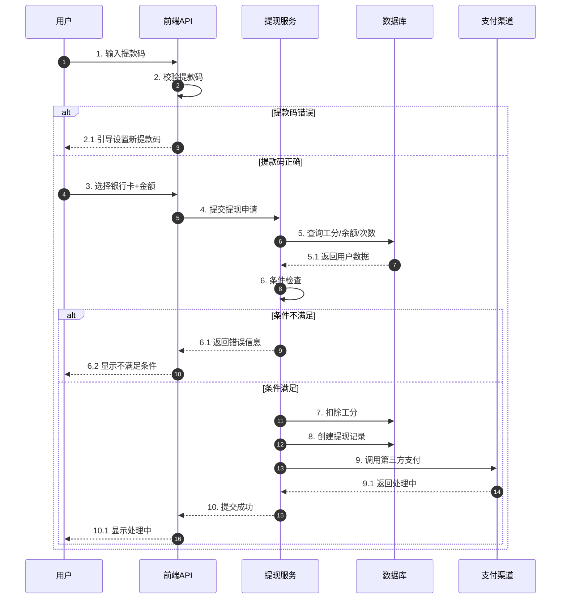
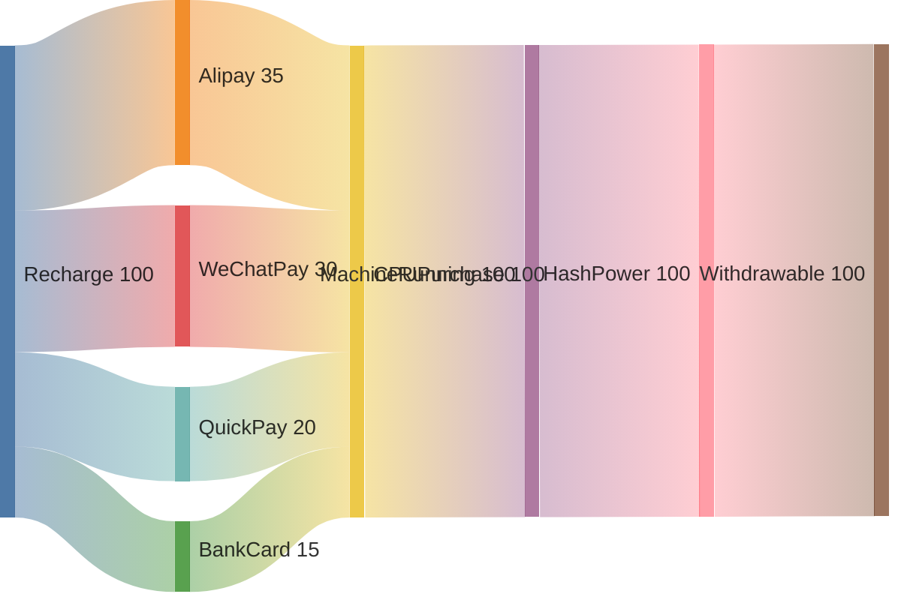
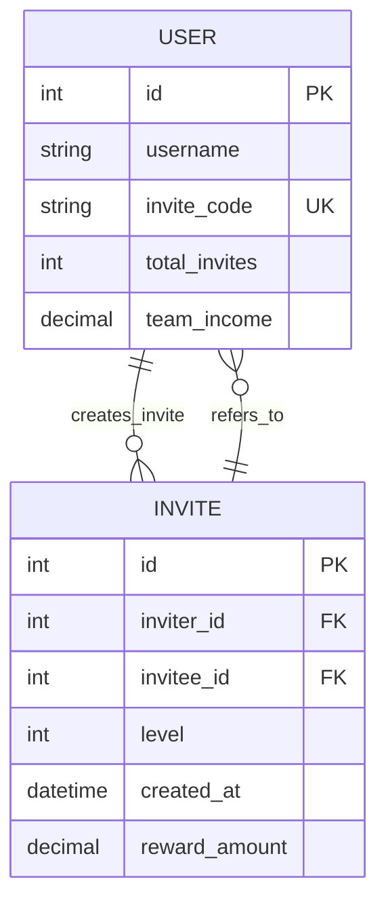
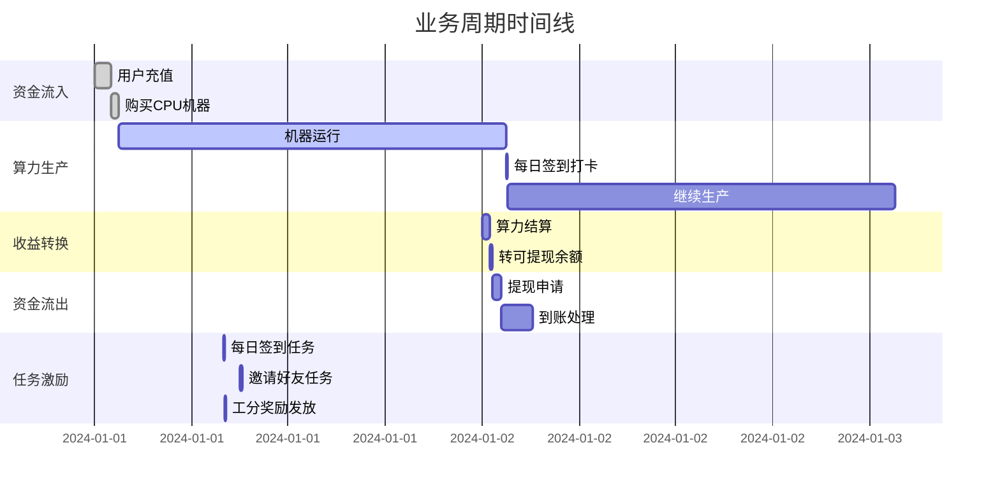

# 公式拆解与流程图

## 一、算力生产公式

### 公式 1: 算力产出计算
```
每小时算力产出 = 产品级别 × 生产力百分比

示例:
1000级 × 0.03% = 30 算力/小时
```

### 公式 2: 24小时周期结算
```
每日总算力 = 每小时产出 × 24小时

示例:
30算力/小时 × 24小时 = 720 算力/日
```

### 公式 3: 多机器叠加
```
总算力 = Σ(每台机器的每小时产出) × 24小时
```

---

## 二、提现计算公式

### 公式 1: 算力转余额
```
可提现余额 = 算力产出 × 1:1 转换比例

说明: 
- 本金不可提现
- 仅算力产出可1:1转为余额提现
```

### 公式 2: 提现限制检查
```
可提现条件:
1. 工分数量 ≥ 最低工分要求
2. 提现金额 ≥ 最低提现额
3. 当日提现次数 < 限制次数
4. 提现金额 ≤ 当前可提现余额
```

---

## 三、余额计算公式

### 公式 1: 提现余额
```
提现余额 = 产品收益 + 推荐奖励 + 其他收益
```

### 公式 2: 充值余额
```
充值余额 = 支付宝充值 + 微信充值 + 银行卡充值 + 快捷支付充值
```

---

## 四、流程图

### 1. 算力生产流程



### 2. 算力计算流程



### 3. 任务奖励流程



### 4. 提现流程



### 5. 充值购买流程



### 6. 用户邀请层级流程



### 7. 整体业务闭环



---

## 五、关键数据关系

```
┌─────────────────────────────────────────────────────────────┐
│                      核心数据公式                             │
├─────────────────────────────────────────────────────────────┤
│                                                             │
│   充值 ──────→ 购买机器 ──────→ 算力生产                    │
│                      ↓                                      │
│              每小时产出 = 级别 × 生产力%                    │
│                      ↓                                      │
│              24小时结算 ───→ 算力累计                       │
│                      ↓                                      │
│              1:1转换 ──────→ 可提现余额                     │
│                      ↓                                      │
│              工分抵扣 ─────→ 提现到账                       │
│                                                             │
│   任务奖励 ──→ 工分 ───────→ 提现必需                     │
│                                                             │
└─────────────────────────────────────────────────────────────┘
```

---

## 六、后台配置参数

| 配置项 | 说明 | 公式影响 |
|--------|------|----------|
| 产品级别 | CPU产品档次 | 影响每小时算力产出 |
| 生产力% | 算力产出比例 | 每小时产出 = 级别 × % |
| 任务工分奖励 | 每项任务奖励 | 工分累计速度 |
| 最低工分要求 | 提现门槛 | 可提现条件检查 |
| 最低提现额 | 单次最低金额 | 可提现条件检查 |
| 每日提现次数 | 次数限制 | 可提现条件检查 |

---

## 七、ASCII 文本流程图（无需渲染）

### 1. 算力生产流程
```
┌─────────────────┐
│ 用户购买CPU机器 │
└────────┬────────┘
         │
    ┌────▼────┐
    │支付成功?│───否──→┌─────────────┐
    └────┬────┘      │ 返回产品页  │
         │是         └─────────────┘
         ▼
┌─────────────────────┐
│ 机器加入我的机器列表 │
└────────┬────────────┘
         │
         ▼
┌─────────────┐     ┌──────────────┐
│ 每日签到打卡 │──→ │ 启动算力生产 │
└─────────────┘     └──────┬───────┘
                           │
                           ▼
              ┌────────────────────┐
              │ 每小时产生算力      │
              │ 30算力/小时        │
              └────────┬───────────┘
                       │
              ┌────────▼────────┐
              │ 24小时周期结束? │
              └────────┬────────┘
                  否 ──┘
                       │是
                       ▼
          ┌─────────────────────────┐
          │ 结算算力到余额          │
          │ 算力1:1转为可提现余额   │
          └──────────┬──────────────┘
                     │
          ┌──────────▼──────────┐
          │ 机器有效期结束?     │
          └──────────┬──────────┘
              否 ────┘
                     │是
                     ▼
            ┌────────────────┐
            │    停止生产    │
            └────────────────┘
```

### 2. 算力计算流程
```
┌──────────┐    ┌──────────┐
│ 产品级别 │    │ 生产力%  │
│ 1000级   │    │  0.03%   │
└────┬─────┘    └────┬─────┘
     │               │
     └───────┬───────┘
             ▼
    ┌────────────────┐
    │   算力计算     │
    │ 1000 × 0.03%   │
    └───────┬────────┘
            │
            ▼
    ┌────────────────┐
    │ 每小时算力产出 │
    │    30算力      │
    └───────┬────────┘
            │
            ▼
    ┌────────────────┐
    │   × 24小时     │
    └───────┬────────┘
            │
            ▼
    ┌────────────────┐
    │   每日总算力   │
    │    720算力     │
    └───────┬────────┘
            │
            ▼
    ┌────────────────┐
    │    1:1转换     │
    └───────┬────────┘
            │
            ▼
    ┌────────────────┐
    │   可提现余额   │
    │    720元       │
    └────────────────┘
```

### 3. 任务奖励流程
```
        ┌──────────────┐
        │    任务类型   │
        └──────┬───────┘
               │
          ┌────▼────┐
          │任务完成?│
          └────┬────┘
               │
     ┌─────────┼─────────┐
     │         │         │
     ▼         ▼         ▼
┌────────┐ ┌────────┐ ┌────────┐
│每日签到│ │邀请好友│ │每日首充│
└───┬────┘ └───┬────┘ └───┬────┘
    │          │          │
    └──────────┼──────────┘
               │
               ▼
        ┌──────────────┐
        │   奖励工分   │
        └──────┬───────┘
               │
               ▼
        ┌──────────────┐
        │   工分累计   │
        └──────┬───────┘
               │
               ▼
        ┌──────────────┐
        │ 用于提现抵扣 │
        └──────────────┘

        ┌──────────────┐
        │   每日0点    │
        └──────┬───────┘
               │
               ▼
        ┌──────────────┐
        │ 任务状态重置 │
        └──────────────┘
```

### 4. 提现流程
```
┌─────────────────┐
│   进入提现页    │
└────────┬────────┘
         │
         ▼
┌─────────────────┐
│ 输入6位提款码   │
└────────┬────────┘
         │
    ┌────▼────┐
    │提款码正确?│
    └────┬────┘
   否 ───┘
         │是
         ▼
┌─────────────────┐
│   选择银行卡    │
└────────┬────────┘
         │
         ▼
┌─────────────────┐
│  输入提现金额   │
└────────┬────────┘
         │
    ┌────▼────┐
    │ 检查条件 │
    └────┬────┘
         │
    ┌────┼────┬────────┬────────┐
    │    │    │        │        │
    ▼    ▼    ▼        ▼        ▼
┌─────┐┌─────┐┌───────┐┌───────┐
│工分≥ ││金额≥ ││次数<  ││金额≤  │
│最低? ││最低? ││日限制?││可提?  │
└──┬──┘└──┬──┘└───┬───┘└───┬───┘
   │      │       │        │
   └──────┼───────┼────────┘
          │
     ┌────▼────┐
     │全部满足?│
     └────┬────┘
    否 ────┘
          │是
          ▼
┌─────────────────┐
│    扣除工分     │
└────────┬────────┘
         │
         ▼
┌─────────────────┐
│  提交提现申请   │
└────────┬────────┘
         │
         ▼
┌─────────────────┐
│  生成提现记录   │
└────────┬────────┘
         │
    ┌────▼────┐
    │到账状态 │
    └────┬────┘
       ┌─┼─┐
       │ │ │
       ▼ ▼ ▼
    ┌────┐┌────┐┌────┐
    │处理││到账││失败│
    │中  ││成功││退回│
    └────┘└────┘└────┘
```

### 5. 充值购买流程
```
┌─────────────────┐
│   浏览产品页    │
└────────┬────────┘
         │
         ▼
┌─────────────────┐
│  选择CPU产品    │
└────────┬────────┘
         │
         ▼
┌─────────────────┐
│  查看产品详情   │
└────────┬────────┘
         │
    ┌────▼────┐
    │决定购买?│
    └────┬────┘
   否 ───┘
         │是
         ▼
┌─────────────────┐
│  点击购买按钮   │
└────────┬────────┘
         │
         ▼
┌─────────────────┐
│  选择支付通道   │
└───────┬─────────┘
   ┌────┼────┬────────┐
   │    │    │        │
   ▼    ▼    ▼        ▼
┌────┐┌────┐┌────┐┌────┐
│支付││微信││快捷││银行│
│宝  ││支付││支付││卡  │
└──┬─┘└──┬─┘└──┬─┘└──┬─┘
   │     │     │     │
   └─────┼─────┼─────┘
         │
         ▼
┌─────────────────┐
│  输入支付密码   │
└────────┬────────┘
         │
    ┌────▼────┐
    │密码正确?│
    └────┬────┘
   否 ───┘
         │是
         ▼
┌─────────────────┐
│ 跳转第三方支付  │
└────────┬────────┘
         │
    ┌────▼────┐
    │支付结果 │
    └────┬────┘
      ┌──┴──┐
      │     │
   成功│  失败│
      │     │
      ▼     ▼
┌──────────┐ ┌──────────┐
│创建订单  │ │显示失败  │
│机器加入  │ │原因      │
│账户      │ └──────────┘
└────┬─────┘
     │
     ▼
┌─────────────────┐
│  开始算力生产   │
└─────────────────┘
```

### 6. 用户邀请层级
```
        ┌─────────────────┐
        │     我的页      │
        └────────┬────────┘
                 │
                 ▼
        ┌─────────────────┐
        │    邀请好友     │
        └────────┬────────┘
         ┌─────┴─────┐
         │           │
         ▼           ▼
┌─────────────────┐ ┌─────────────────┐
│   生成邀请码    │ │  生成分享链接   │
└─────────────────┘ └─────────────────┘

        ┌─────────────────┐
        │好友通过链接注册 │
        └────────┬────────┘
                 │
                 ▼
        ┌─────────────────┐
        │   绑定邀请关系   │
        └────────┬────────┘
                 │
                 ▼
        ┌─────────────────┐
        │   计入一级邀请   │
        └────────┬────────┘
                 │
            ┌────▼────┐
            │好友再邀请?│
            └────┬────┘
           否 ───┘
                 │是
                 ▼
        ┌─────────────────┐
        │被邀请人计入二级 │
        └─────────────────┘

        ┌─────────────────┐
        │   我的团队页面  │
        └────────┬────────┘
         ┌───────┼───────┐
         │       │       │
         ▼       ▼       ▼
    ┌────────┐┌────────┐┌────────┐
    │一级人数││二级人数││团队收益│
    └────────┘└────────┘└────────┘
```

### 7. 整体业务闭环
```
  ┌───────────────────────────────────────────────────────────────┐
  │                         资金流入                              │
  │  ┌─────────┐    ┌───────────┐    ┌──────────┐                 │
  │  │  充值   │───→│ 购买机器  │───→│ 机器运行 │                 │
  │  └─────────┘    └───────────┘    └────┬─────┘                 │
  └───────────────────────────────────────┼───────────────────────┘
                                          │
  ┌───────────────────────────────────────┼───────────────────────┐
  │                      算力生产         │                       │
  │  ┌───────────┐    ┌───────────┐      │                       │
  │  │ 每日签到  │───→│ 24小时生产 │←─────┘                       │
  │  └───────────┘    └─────┬─────┘                              │
  │                         │                                    │
  │                         ▼                                    │
  │                  ┌───────────┐                               │
  │                  │ 算力产出  │                               │
  │                  └─────┬─────┘                               │
  └────────────────────────┼──────────────────────────────────────┘
                           │
  ┌────────────────────────┼──────────────────────────────────────┐
  │                      收益转换                                  │
  │                        │                                       │
  │                        ▼                                       │
  │                 ┌───────────┐                                  │
  │                 │ 1:1转余额 │                                  │
  │                 └─────┬─────┘                                  │
  │                       │                                        │
  │                       ▼                                        │
  │                 ┌───────────┐                                  │
  │                 │ 可提现余额│                                  │
  │                 └─────┬─────┘                                  │
  └───────────────────────┼────────────────────────────────────────┘
                          │
  ┌───────────────────────┼────────────────────────────────────────┐
  │                      资金流出                                    │
  │                       │                                         │
  │                       ▼                                         │
  │                 ┌───────────┐                                   │
  │                 │  完成提现 │                                   │
  │                 └───────────┘                                   │
  └─────────────────────────────────────────────────────────────────┘

  ┌─────────────────────────────────────────────────────────────────┐
  │                      任务激励                                    │
  │  ┌──────────┐    ┌──────────┐    ┌──────────┐                   │
  │  │ 每日签到 │    │ 邀请好友 │    │ 每日首充 │                   │
  │  └────┬─────┘    └────┬─────┘    └────┬─────┘                   │
  │       │              │              │                           │
  │       └──────────────┼──────────────┘                           │
  │                      │                                          │
  │                      ▼                                          │
  │               ┌───────────┐                                     │
  │               │  奖励工分 │                                     │
  │               └─────┬─────┘                                     │
  │                     │                                           │
  │                     ▼                                           │
  │               ┌───────────┐                                     │
  │               │工分用于提 │                                     │
  │               │现抵扣     │                                     │
  │               └───────────┘                                     │
  └─────────────────────────────────────────────────────────────────┘

  ┌─────────────────────────────────────────────────────────────────┐
  │                      推广裂变                                    │
  │  ┌──────────┐    ┌──────────┐    ┌──────────┐                   │
  │  │ 邀请好友 │───→│ 一级邀请 │───→│ 二级邀请 │                   │
  │  └──────────┘    └──────────┘    └──────────┘                   │
  └─────────────────────────────────────────────────────────────────┘
```
